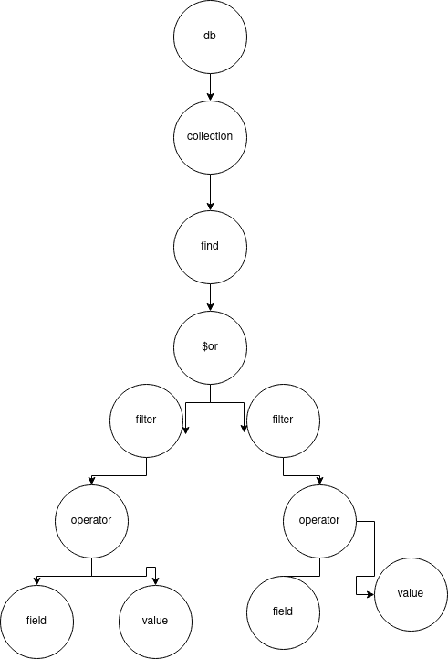

## mongosh

<a href="https://www.mongodb.com/docs/manual/reference/method/">
mongodb docs
</a>

- use $db;

### Database Methods 
- db
  - .createCollection($collection, $schema)
  - .getCollection(query criteria)
  - .dropDatabase()

### Collection Methods
- db.collection
  - .count(query criteria)
  - .find(query criteria)
  - .findOne(query criteria)
  - .insertOne($document)
  - .insertMany([$document, ...])
  - .remove(query criteria, justOne)
  - .renameCollection(target, dropTarget)
  - .update(query criteria, update/document)
  - .updateOne(query criteria, update/document)

### Comparison
$eq - Matches all values that are equal to a specified value.

$ne - Matches all values that are not equal to a specified value.

$gt - Matches numeric values that are greater than a specified value.

$gte - Matches numeric values that are greater than or equal to a specified value.

$lt - Matches numeric values that are less than a specified value.

$lte - Matches numeric values that are less than or equal to a specified value.

$regex - Matches string values that match pattern

### Conditions
https://www.mongodb.com/docs/manual/tutorial/query-documents/#specify-or-conditions


### Examples

#### Data
```
db.movies.find( {
     year: 2010,
     $or: [ { "awards.wins": { $gte: 5 } }, { genres: "Drama" } ]
} );

db.movies.count( {
  year: 2023,
  $or: [ { author: { $ne: "Truffaut" } ]
});

db.movies.count( {
  year: 2022,
  released: 2023
});
```

```
db.inventory.find( { status: "A", qty: { $lt: 30 } } );
```

#### Schemas (as I imagined)
```
db.createCollection("example", 
  {
    name: "string",
    int_field: "int32",
    double_field: "double",
    is_example: "bool"
  } 
);

db.getCollection("example");
```


## AST
